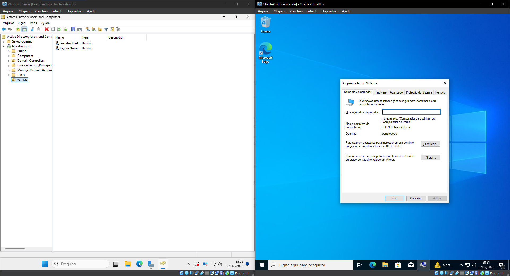

# Laboratório de Redes de Computadores e Active Directory

Este repositório documenta um laboratório prático de Redes de Computadores e Active Directory, desenvolvido em ambiente virtualizado, com foco em fundamentos de redes e administração básica de servidores Windows.

O objetivo é consolidar conceitos teóricos por meio de implementação prática.

## Conteúdos abordados

- Fundamentos de redes de computadores
- Endereçamento IP, DHCP e DNS
- Testes de conectividade e diagnóstico de rede
- Principais protocolos de rede
- Compartilhamento e mapeamento de rede no Windows
- Instalação e configuração do Windows Server em máquina virtual
- Configuração do Active Directory (AD DS)
- Criação de domínio, usuários e OUs
- Ingresso de estação Windows 10 no domínio
- Projeto básico de cabeamento estruturado

## Ambiente do laboratório

- Windows Server 2025 (Controlador de Domínio)
- Windows 10 (Cliente ingressado no domínio)
- Active Directory Domain Services (AD DS)
- DNS
- VirtualBox

## Arquitetura

- 1 servidor Windows (DC)
- 1 estação Windows 10
- Ambiente de laboratório isolado

## Evidências

As evidências do laboratório estão disponíveis na pasta `/imagens`.

## Observações

Ambiente criado exclusivamente para fins de estudo, sem dados reais ou informações sensíveis.

## Contexto do projeto

Este laboratório foi desenvolvido com base no *Curso Prático de Redes de Computadores*, da Hardware Redes Brasil Cursos, como parte do processo de aprendizado e fixação dos conceitos apresentados.

